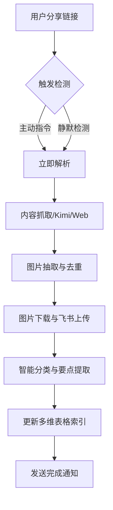

# OpenClaw - 智能内容自动化归集系统


## 🚀 项目简介

**OpenClaw** 是一个基于 AI 驱动的自动化内容收集与知识管理系统。它能够自动识别、抓取并收录社交平台（如微信公众号）、飞书文档及各类网页内容，并将其实时转化为结构化的飞书知识库文档。

核心愿景：**让有价值的信息零成本沉淀，让知识库随看随存。**

---

## ✨ 核心特性

- **多模式触发**：支持“显式指令”主动收录与群聊场景下的“静默收录”。
- **深度内容解析**：自动剥离网页杂质，精准提取标题、正文及核心摘要。
- **飞书生态联动**：一键生成飞书 Docx 文档，并同步更新多维表格（Bitable）索引。
- **智能分类体系**：基于 LLM 的内容理解，自动判定技术教程、实战案例等 8 大分类。
- **图片自动化托管**：自动下载网页图片并上传至飞书，解决外链失效与显示权限难题。
- **预检安全机制**：内置安装预检流程，确保 OAuth 授权与空间权限时刻就绪。

---

## 🛠️ 工作流引擎



---

## 📦 快速开始

### 1. 技能安装
将本仓库克隆至你的 Agent 工作目录，或直接引用 `content-collector/SKILL.md`。

### 2. 环境配置
在你的 `MEMORY.md` 中补充以下配置项：

```markdown
## Content Collector Config
- **Knowledge Base Table**: `[你的多维表格 App Token]`
- **Knowledge Base Space ID**: `[你的知识库节点 ID]`
- **Content Categories**: 技术教程, 实战案例, 产品文档, 学习笔记...
- **Image Fetch Mode**: `all` / `cover_only`
- **Image Max Count**: `20`
- **Image Max Size MB**: `10`
- **Image Timeout Sec**: `20`
```

### 3. 权限预检
在首次运行前，技能会自动执行权限校验，请按照引导完成飞书 OAuth 授权。

### 4. 图片能力说明（v2）
- 同时抽取 Markdown 与 HTML 的图片引用（含懒加载属性）。
- 自动将可访问图片下载到本地临时文件并上传到飞书素材库。
- 文档正文内图片自动替换为飞书 `image_key`，降低外链失效风险。
- 单张图片失败不会阻断收录，最终文档会保留失败提示与原始来源链接。

---

## 📖 使用指南

### 主动模式
用户：*“存一下这个链接：https://mp.weixin.qq.com/s/...”*
Agent：*“✅ 收录完成。生成文档：🔥 标题 | 2026-03-09”*

### 静默模式
在已配置的群聊中，直接粘贴链接，系统将自动进行后台收录并发送简洁通知。

---

## 📂 项目结构

```text
openclaw/
└── content-collector/
    └── SKILL.md          # 核心技能逻辑定义
```

---

## 📜 许可证

本项目遵循 [MIT License](LICENSE) 协议。

---

> 此项目由 **Antigravity** 辅助设计与开发，致力于构建极致的 AI 自动化体验。
